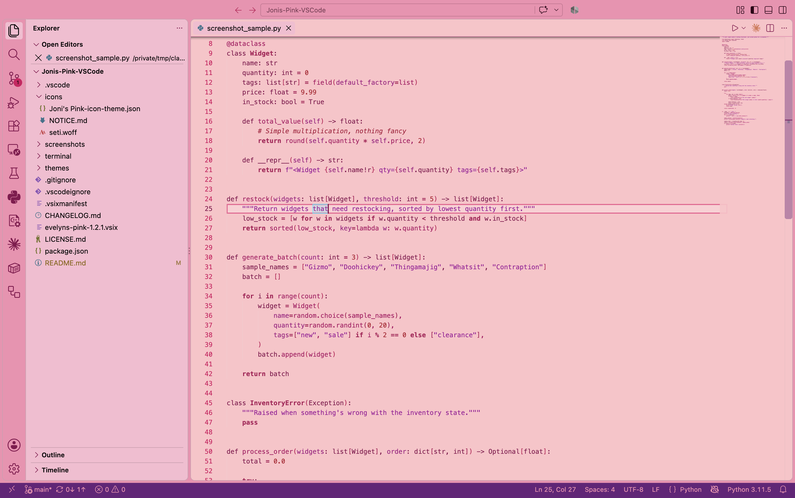
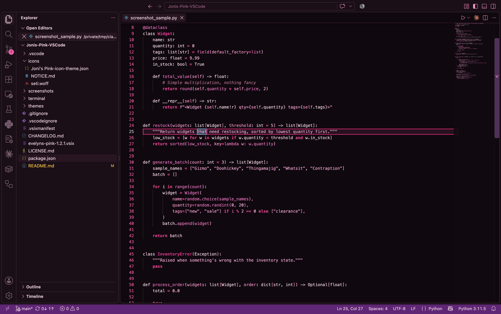

# Joni's Pink (VS Code Theme)

A soft and aesthetic pink theme for Visual Studio Code, designed to be cute, readable, and calm.  
Perfect for those who love pastel vibes, clean syntax highlighting, and a cozy coding experience.

This is a personal fork of [Evelyn's Pink](https://github.com/Evelynox/Evelyns-Pink-VSCode) by [Evelynox](https://github.com/Evelynox), with additional readability tweaks (cursor contrast, bracket/word highlighting, bright ANSI terminal colors, notebook colors). All credit for the original design goes to Evelyn — this fork exists to keep my personal edits in sync across machines.

---

## 📸 Preview

| Joni's Pink | Joni's Pink Dark |
| --- | --- |
|  |  |

---

## ✨ Features

- Light pink background with deep contrast highlights, plus a "Joni's Pink Dark" variant
- Purple accent system (status bar, focus rings, active selections, scrollbar) layered on top of the pink, with blue used for info-level icons/messages
- A matching "Joni's Pink Icons" file icon theme, with glyph colors tuned for contrast against this theme's pink/purple UI instead of VS Code's usual dark-background defaults
- Carefully chosen colors for readability and accessibility
- Fully themed UI, including activity bar, sidebar, status bar, and terminal
- Styled for consistency across languages (JS, Python, C++, HTML, etc.)

---

## 🔧 Installation

This fork isn't published to the Marketplace — it's meant to be used as a local dev extension, symlinked into place so a `git pull` updates it everywhere automatically:

1. Clone this repo somewhere stable (e.g. `~/Programming (Local)/Jonis-Pink-VSCode`)
2. Symlink it into your VS Code extensions folder, named to match `<publisher>.<name>-<version>` from [package.json](package.json) (currently `justinmeredith.jonis-pink-1.4.0` — bump the version in the folder name if it's changed since):
   ```sh
   ln -s "$HOME/Programming (Local)/Jonis-Pink-VSCode" ~/.vscode/extensions/justinmeredith.jonis-pink-1.4.0
   ```
   Use `$HOME`, not `~`, inside the quotes — a quoted `~` isn't expanded by the shell, and silently produces a broken symlink that looks fine in a listing but resolves to nothing.
3. Fully restart VS Code, not just a window reload — new contributions (themes, icon themes) are only read at startup.
4. `Cmd+K Cmd+T` (macOS) or `Ctrl+K Ctrl+T` → select **Joni's Pink** or **Joni's Pink Dark**.
5. Command Palette → **Preferences: File Icon Theme** → **Joni's Pink Icons** (this doesn't follow the color theme automatically — it's a separate, per-machine setting).

Pulling later updates (`git pull`) refreshes the symlinked files immediately; if something doesn't seem to update, confirm the symlink itself is still intact before digging further:

```sh
ls -la ~/.vscode/extensions/justinmeredith.jonis-pink-1.4.0
```

A `->` pointing at a real path that resolves is healthy; anything else (a plain directory, or an arrow to a path that doesn't exist) means VS Code is loading a stale, disconnected copy — redo steps 1–2.

For the original, unmodified theme, install [Evelyn's Pink from the VS Code Marketplace](https://marketplace.visualstudio.com/items?itemName=Evelyn.evelyns-pink).

---

## 🖥 Terminal Prompt

`terminal/prompt.zsh` carries the matching zsh prompt/banner, kept pure ASCII on purpose — emoji and other ambiguous-width Unicode characters can make the shell's cursor-position math disagree with how a terminal actually renders them, causing the cursor to drift out of sync with the text as you type.

To use it on a machine:

1. Clone this repo somewhere stable (e.g. `~/Programming (Local)/jonis-pink-vscode`)
2. Add this line to `~/.zshrc`:
   ```sh
   source "$HOME/Programming (Local)/jonis-pink-vscode/terminal/prompt.zsh"
   ```
3. Open a new terminal tab to pick it up

Pulling the latest repo (`git pull`) updates the prompt everywhere it's sourced from, without touching anything else in `.zshrc`.

---

## 📃 License

[GNU General Public License v3.0](LICENSE.md)

---

Made with 🩷 by Evelyn